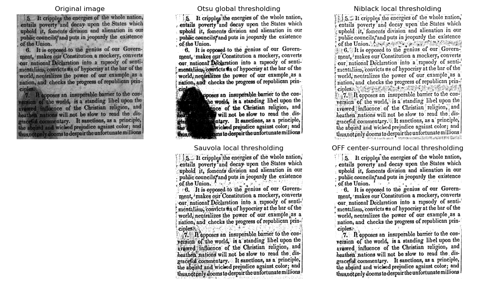

# Document binarization with OFF center-surround cells of the Human Visual System
Python function implementing a **text binarization function** based on activations of modeled **OFF center-surround cells** of the retina, which detect light decrements (text) on bright background (page). The approach is robust to strong illumination changes, like shadows or highlights, making it good for text images which have been caputred outdoors, perhaps with a mobile phone. 



# Usage
The function should work directly "out of the box". Just pass an RGB or grayscale document image (of dark text over a bright background) and get its binary version. 


# Contents:
```tree
│   environment_requirements.txt                       [Environment file for the required version of libraries]
├── source                                             [Directory: Source code]
│   ├── emotions_dlib.py                               [The main set of classes for emotion estimation, feature generation and landmark frontalization] 
│   ├── Extract_features_and_train_model.ipynb         [Jupyter notebook demonstrating end-to-end data loading, feature generation, analysis and model training]
│   ├── extract_features.py                            [Independent script for generating features]
│   ├── train_emotions.py                              [Independent script for training emotion models, based on generated features]
│   ├── example_test_emotions_singleimage.py           [Example of applying emotion estimation on faces from a single image]
│   └── example_test_realtime_emotions.py              [Example of applying real-time emotion estimation on faces from a camera]
├── models                                             [Directory: Models]
│   ├── shape_predictor_68_face_landmarks.dat          [DLIB facial landmark model] 
│   ├── model_frontalization.npy                       [Frontalization facial landmark model] 
│   └── model_emotion_pls=30_fullfeatures=False.joblib [Emotion pretrained model]
└── data                                               [Directory: dataset]
    ├── Morphset.csv                                   [Dataset of anonymized facial landmarks with morphed expressions and emotion annotations]
    └── images                                         [Directory: sample test images and examples]
```


# Dependences
- skimage
- imageio
- matplotlib


# Citation
If you use this code in your research please cite the following paper:
1. [Vonikakis, V., Andreadis, I., & Papamarkos, N. (2011). Robustdocument binarization with OFF center-surround cells. Pattern Analysis and Applications, 14(3), 219-234.](https://www.researchgate.net/publication/226333284_Robust_document_binarization_with_OFF_center-surround_cells)
2. [Vonikakis, V., Andreadis, I., Papamarkos, N., & Gasteratos, A. (2007). Adaptive Document Binarization: AHuman Vision Approach. Int. Conference on Computer Vision Theory and Applications. (pp. 104-110). Barcelona, Spain.](https://www.researchgate.net/publication/221415249_Adaptive_document_binarization_A_human_vision_approach)
