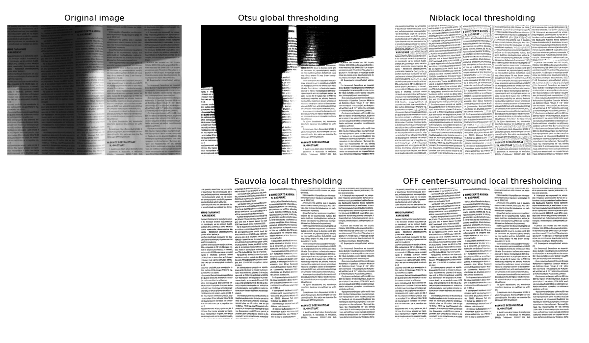

# Document binarization with OFF center-surround cells
Python function implementing a **text binarization function** based on activations of modeled **OFF center-surround cells** of the Human Visual System, which detect light decrements (text) on bright background (page). The approach is robust to strong illumination changes, like shadows or highlights, making it good for text images which have been captured outdoors, perhaps with a mobile phone. 

## Example of a document with a stain


## Example of a document with a strong shadow, captured with a mobile phone


# Usage
The function should work directly "out of the box". Just pass an RGB or grayscale document image (of dark text over a bright background) and get its binary version. 


# Contents:
```tree
├── code                             [Directory: Source code]
│   └── text_binarization.py         [The main binarization function, along with example demonstrations] 
└── data                             [Directory: dataset. Test images and example]
```


# Dependences
- skimage
- imageio
- matplotlib


# Citation
If you use this code in your research please cite the following paper:
1. [Vonikakis, V., Andreadis, I., & Papamarkos, N. (2011). Robustdocument binarization with OFF center-surround cells. Pattern Analysis and Applications, 14(3), 219-234.](https://www.researchgate.net/publication/226333284_Robust_document_binarization_with_OFF_center-surround_cells)
2. [Vonikakis, V., Andreadis, I., Papamarkos, N., & Gasteratos, A. (2007). Adaptive Document Binarization: AHuman Vision Approach. Int. Conference on Computer Vision Theory and Applications. (pp. 104-110). Barcelona, Spain.](https://www.researchgate.net/publication/221415249_Adaptive_document_binarization_A_human_vision_approach)
